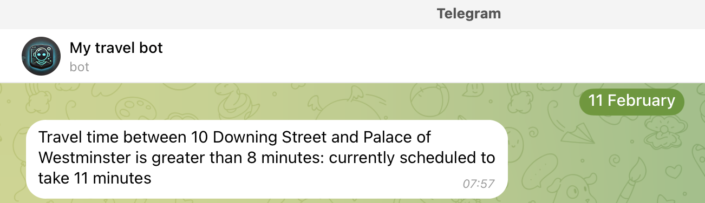

# Wayfarer


A standalone application which notifies users via Telegram when their scheduled journey time exceeds a threshold.
Useful for commuters who can work from home occasionally to avoid a long commute.



## Usage

1. Create a Telegram bot and get the bot token.
2. Create a Google API key and enable the Directions API.
3. For the Telegram accounts you want to notify:
    1. Get the user ID. Perhaps with [@userinfobot](https://telegram.me/userinfobot).
    2. Start a conversation with your bot. This is necessary so the bot can send messages to the user. 
4. Create your config file
    ```shell
    touch config.yaml
    ```
   and add your rules to the config file
    ```yaml
    rules:
      - id: 1
        origin:
          name: 10 Downing Street
          longitude: -0.1276
          latitude: 51.503
        destination:
          name: Palace of Westminster
          longitude: -0.1246
          latitude: 51.498
        user:
          telegram_user_id: your_telegram_user_id
        travel_time:
          notification_threshold_minutes: 8
        times:
          - day: MONDAY
            time: 09:00
          - day: TUESDAY
            time: 09:00
          - day: WEDNESDAY
            time: 09:00
          - day: THURSDAY
            time: 09:00
          - day: FRIDAY
            time: 09:00
        timezone: Europe/London
        holidays:
          - 2025-12-25
          - 2025-12-26
          - 2026-01-01
         ```
5. Create an environments file
    ```shell
    touch .env
    ```
   and add your environment variables
    ```shell
    TELEGRAM_BOT_TOKEN=your_telegram_bot_token
    GOOGLE_API_KEY=your_google_api_key
    ```
6. Run the application
    ```shell
    docker run --env-file .env --volume $(pwd)/config.yaml:/app/config.yaml toddljones1/wayfarer:latest
    ```